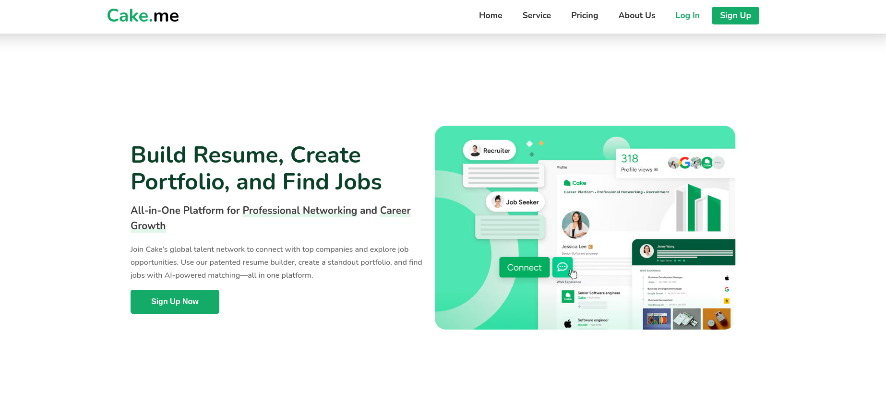

# Proyek HTML, CSS (Flexbox), dan JavaScript

📖 **Tentang Proyek**  
Proyek ini merupakan bagian dari tugas akhir dalam kursus "Belajar Dasar Pemrograman Web" di Dicoding. Proyek ini bertujuan untuk mengasah pemahaman dalam penggunaan HTML, CSS (khusus Flexbox), dan JavaScript untuk membangun halaman web yang responsif dan fungsional.

🛠 **Teknologi yang Digunakan**  
- **HTML**: Untuk membangun struktur konten.  
- **CSS (Flexbox)**: Untuk mengatur tata letak dan gaya halaman.  
- **JavaScript**: Untuk menambahkan interaktivitas pada halaman.

🎯 **Tujuan Proyek**  
- Mengaplikasikan Flexbox untuk membuat layout yang responsif.
- Menggunakan JavaScript untuk menambahkan fungsionalitas pada halaman.
- Meningkatkan keterampilan dalam pengembangan web dengan teknologi dasar.

📂 **Struktur Proyek**  
- `index.html`: Berisi struktur halaman.  
- `styles.css`: Berisi aturan CSS untuk styling halaman.  
- `script.js`: Berisi logika JavaScript untuk interaktivitas halaman.

✨ **Fitur-Fitur**  
- **Bagian Header**:
  - Judul: "Proyek Akhir" dengan teks besar dan tebal yang dipusatkan.
  - Subjudul: "Belajar Dasar Pemrograman Web" dengan teks lebih kecil dan miring.
  
- **Bagian Gambar**:
  - Gambar terpusat dengan border putih dan efek bayangan halus.

- **Detail Styling**:
  - Latar belakang berwarna kontras untuk menonjolkan teks dan gambar.
  - Pengaturan font (ukuran, berat, penataan teks) untuk meningkatkan keterbacaan dan estetika.
  - Dimensi gambar dan styling untuk memastikan alignment dan tampilan visual yang menarik.

📸 **Pratinjau Proyek**  
Berikut adalah tangkapan layar dari proyek ini:



🧠 **Pelajaran yang Dipetik**  
- Cara menggunakan properti Flexbox seperti `justify-content`, `align-items`, dan `flex-direction`.
- Cara menambahkan interaktivitas dengan JavaScript seperti event handling dan DOM manipulation.
- Pentingnya tata letak yang responsif dalam desain web modern.

🚀 **Cara Menjalankan Proyek**  
1. Klon repositori ini ke mesin lokal Anda:
   ```bash
   git clone https://github.com/rizkibagus/cake-main.git
